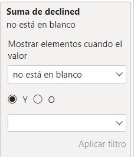
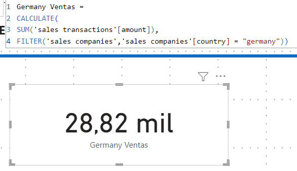

<center><h1>Sprint 5 - Nivell 1</h1></center>

## Exercici 1

I) Realizo la conexion con MySQL para obtener la base de datos ***sales***, que fue la que creé en MySQL para el sprint_4.

<center>        

        

</center>     


<center>
    <p style="line-height: 0.25;">En este caso podemos ver las 8 tablas extraídas desde MySQL.</p> 
    <p style="line-height: 0.25;">Card_status corresponde a aquella que creamos para el sprint_4.</p>
</center>

II) Ademas haré la creacion de la tabla ***users*** a partir de las tres tablas disponibles.

Para ello tengo el comando de ***anexar para crear nueva consulta***:
<center>  


</center> 

- Lo primero es que todos los id se llamen igual y que los datos sean anexables. Es decir que el tipo de dato de cada campo sea el mismo. 

3. A las tablas les hago el *custom* de los campos.


Es importante tambien hacer enfasis en la necesidad de hacer `cast`de las variables. Por ejemplo, la fechas que estan como texto, hacerlas que esten es formato `fecha`

## Exercici 2

La teva empresa està interessada a avaluar la suma total del amount de les transaccions realitzades al llarg dels anys.     

Per a aconseguir això, s'ha sol·licitat la creació d'un indicador clau de rendiment (KPI). El KPI ha de proporcionar una visualització clara de l'objectiu empresarial d'aconseguir una suma total de 25.000 € per cada any.

1. Primero creo la medida de 
   1. `KPI objetivo (euros) = 25.000 €`
    

1. Creo una matriz en la que tengo como filas los años y como campos el total de ventas.

    

3. Realizo el filtro de aceuerdo a `declined = 1`
   
    
   
4. Obtengo el KPI de acuerdo a la visulaizacion correspondiente: 

    


## Exercici 3

Des de màrqueting et sol·liciten crear una nova mesura DAX que calculi la mitjana de transaccions realitzades durant l'any 2021. 

Mesura DAX  y resultado en etiqueta: 
    


És important recordar que l'empresa té un objectiu de vendes establert en 250 transaccions.     
Lo primero es crear la nueva medida de KPI 250 transacciones:


Finalmente tenemos: 


## Exercici 4
Realitza el mateix procediment que vas realitzar en l'exercici 3 per a l'any 2022.


## Exercici 5

L'objectiu d'aquest exercici és crear una KPI que visualitzi la quantitat d'empreses per país que participen en les transaccions.       

La meta empresarial és garantir que hi hagi almenys 3 empreses participants per país.    

`KPI = 3`

Per a aconseguir això, serà necessari utilitzar DAX per a calcular i representar aquesta informació de manera clara i concisa: 


## Exercici 6


Genero un filtro para mostrar solo los meses con datos:




## Exercici 7

Crea un gràfic de columnes agrupades que reflecteixi la sumatòria de les vendes per mes.        

L'objectiu de l'empresa és tenir almenys 10.000 transaccions per mes.


## Exercici 8

En aquest exercici, es vol aprofundir en les transaccions realitzades per cada usuari/ària i presentar la informació de manera clara i comprensible. 

Lo primero será crear aquellas columnas que solicitan como:

| N | Campo            | Descripción                                             |
|---|------------------|---------------------------------------------------------|
| 1 | Nom i cognom     | Nombre y Apellido                                       |
| 2 | Edat             | A partir de birth_date obtengo la edad                  |
| 3 | Mitjana euros    | Media en Euros                                          |
| 4 | Mitjana dòlars   | Media en Dólares a traves de la equivalencia entregada. |
| 5 | Condición        | Cumple/No Cumple                                        |


1. Nom i cognom


2. Edat: .
   
3. Mitjana euros: Sumatoria de amount
   
4. Mitjana dòlars: Creo una nueva medida:
   
   

5.  La condicion queda reflejada en:
   

   Finalmente la tabla es:

   


## Exercici 9

Redacta un paràgraf breu, de màxim 50 paraules, explicant el significat de les xifres presentades en les visualitzacions de Power BI. Pots interpretar les dades en general o centrar-te en algun país específic. Acompanya les interpretacions realitzades amb la captura de pantalla de les visualitzacions que analitzaràs:


<center><h1>Sprint 5 - Nivell 2</h1></center>

## Exercici 1


## Exercici 2

Creo el DAX de ventas totales de alemania: 



**CALCULATE:** Esta función se utiliza para modificar el contexto de evaluación de otras funciones. En este caso, se utiliza para aplicar un filtro al cálculo de las ventas.   
```SUM('sales transactions'[amount])```: Esto suma el monto de las ventas de la tabla 'sales transactions'.

```FILTER('sales companies', 'sales companies'[country] = "germany")```: Esto filtra la tabla 'sales companies' para que solo incluya las filas donde el país es "germany".

En resumen, esta expresión DAX calcula la suma de las ventas ('amount') en la tabla 'sales transactions', pero solo considera las ventas realizadas por empresas con sede en Alemania, según lo especificado en la tabla 'sales companies'. Si las relaciones entre las tablas están configuradas correctamente y los nombres de las columnas son precisos, esta DAX debería funcionar como se espera.